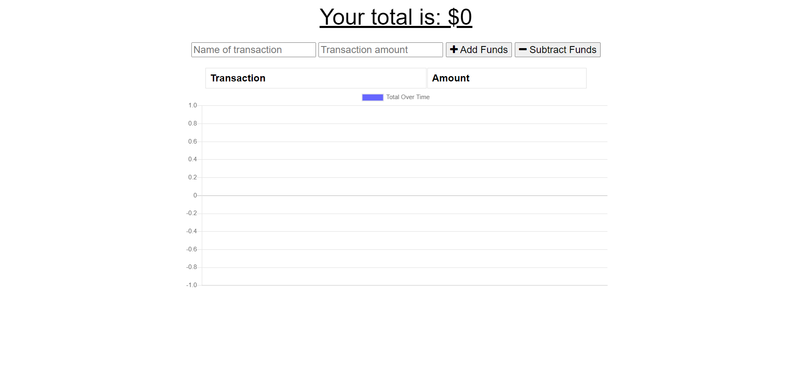
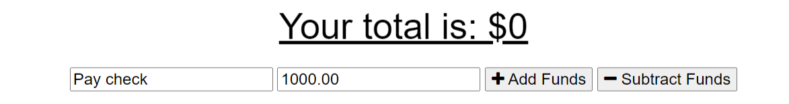
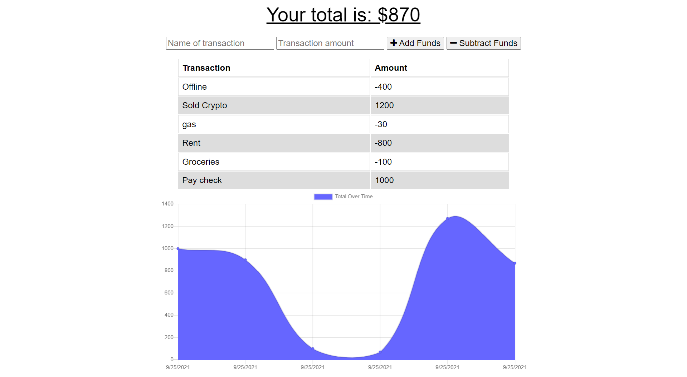
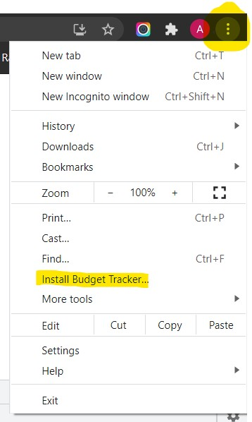

# Budget-Tracker

[Link to Deployed App](https://intense-chamber-46703.herokuapp.com/)

## Description

An installable budget tracking app. Users can add and subtract funds while online or offline, transactions recorded while offline will update once connectivity is restored.

## Table of Contents

- [Usage](#usage)
- [Technologies Used](#technologies-used)
- [Questions](#questions)

## Usage

1. Go to the [Budget Tracker App](https://intense-chamber-46703.herokuapp.com/) 

2. Enter a transaction name and dollar amount.

3. Click either '+ Add Funds' or '- Subtract Funds' and the amount entered will be added or subtracted to the current budget total.

4. Click the three dots in the top right of the screen (in Chrome), then select 'Install Budget Tracker' to install the app

## Technologies used
* Javascript
* Node.js
* Express.js
* MongoDB
* Mongoose.js
* Heroku
* IndexedDB

## Questions

For any additional questions please reach out to me at:

[My Github Profile](https://github.com/AdrianCronin)

[Email](mailto:acronindev@gmail.com)

